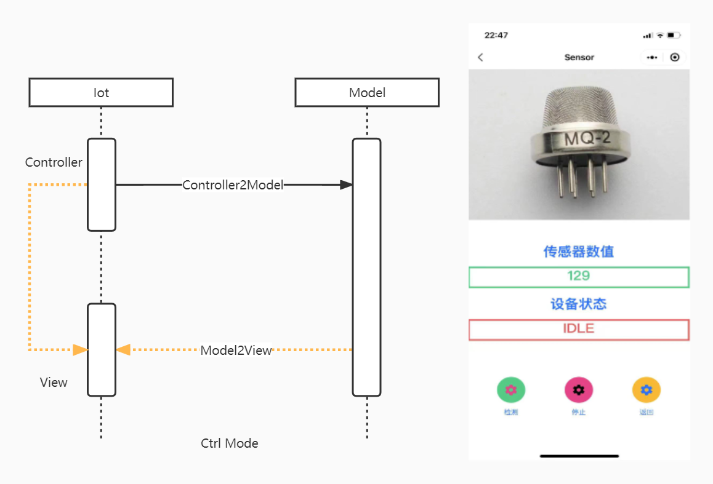
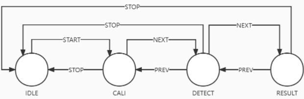
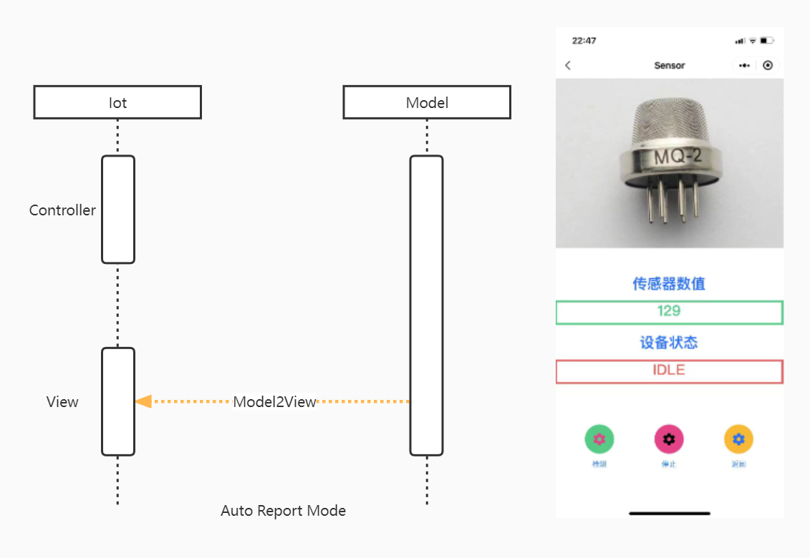

# IotSensorDetect
这是一个基于MVC模式+状态设计模式的物联网气体检测开源项目，整体软件框架如下所示：

**待补充完善**

其中，软件通信时序分为两种模式：

- 1、Ctrl Mode

该模式由APP端发起，对于APP端来说，APP端可以下发三种命令，分别是检测、停止、返回，如下图所示：



当用户按下检测时，APP端会下发START命令来控制传感器进行检测，期间检测过程中的设备状态以及传感器数值会进行更新，检测过程也可以通过下发停止来打断；而返回则是根据当前的设备状态来返回到上一个检测状态；这一切是通过状态模式来维护的，期状态机如下：



在程序中，该状态流程图是通过一个结构体数组来定义的：

```c
SensorStateItem_t SensorStateTable[] =
{
    {IDLE,   START, CALI},      //IDLE->START->CALI
    {CALI,   NEXT,  DETECT},    //CALI->NEXT->DETECT
    {CALI,   STOP,  IDLE},      //CALI->STOP->IDLE
    {DETECT, NEXT,  RESULT},    //DETECT->NEXT->RESULT
    {DETECT, PREV,  CALI},      //DETECT->PREV->CALI
    {DETECT, STOP,  IDLE},      //DETECT->STOP->IDLE
    {RESULT, PREV,  DETECT},    //RESULT->PREV->DETECT
    {RESULT, STOP,  IDLE},      //RESULT->STOP->IDLE
};
```

切换状态的过程是由`DoSensorStatus`来实现的：

```c
__IO SensorState_t CurState = IDLE;  //当前状态
__IO SensorState_t PrevState = IDLE; //上一个状态

SensorStateItem_t *FindCurStateAndEvent(SensorState_t CurState, SensorEvent_t Event)
{
    int Index = 0;
    //查状态表
    for(Index = 0; Index < NR_MODEL(SensorStateTable); Index++)
    {
        if(SensorStateTable[Index].CurState == CurState \
                && SensorStateTable[Index].Event == Event)  \
            return &SensorStateTable[Index];
    }

    return NULL;
}
//执行状态机
int DoSensorStatus(SensorEvent_t Event)
{
    int Ret = 1;
    SensorStateItem_t *Item;
    //根据当前的状态、事件找到状态表中的那一项，取到那一项的地址
    Item = FindCurStateAndEvent(CurState, Event);

    if (!Item)
        return 0;
    //保存上一个状态
    PrevState = CurState;
    //切换到下一个状态
    CurState = Item->NextSate;
    return Ret;
};
```

- 2、Auto Report Mode

该模式是由设备端主动定时上报给到APP端，如下图所示：

